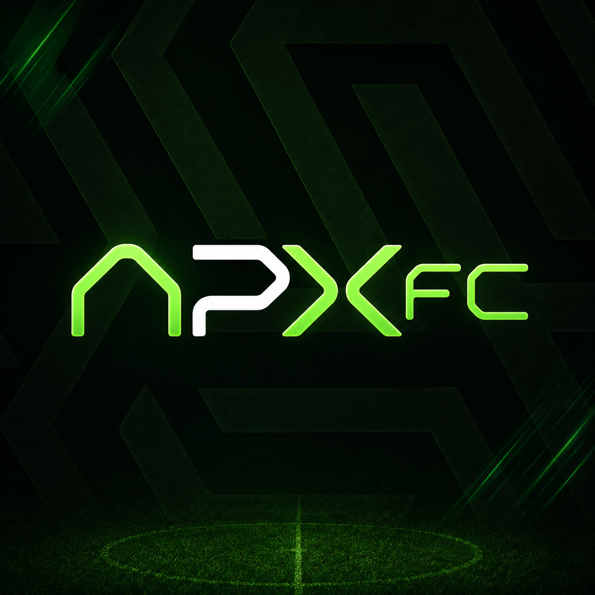

<!-- Improved compatibility of back to top link: See: https://github.com/othneildrew/Best-README-Template/pull/73 -->
<a id="readme-top"></a>


<!-- PROJECT LOGO -->
<br />
<div align="center">
  <a href="https://github.com/greghouse-dd/ApexFC">
    
  </a>

  <h3 align="center">ApexFC</h3>

  <p align="center">
    AI-Driven Football Operations & Roster Analytics Workspace
    <br />
    <a href="https://github.com/greghouse-dd/ApexFC"><strong>Explore the docs »</strong></a>
    <br />
    <br />
    <a href="https://github.com/greghouse-dd/ApexFC">View Demo</a>
    &middot;
    <a href="https://github.com/greghouse-dd/ApexFC/issues/new?labels=bug&template=bug-report---.md">Report Bug</a>
    &middot;
    <a href="https://github.com/greghouse-dd/ApexFC/issues/new?labels=enhancement&template=feature-request---.md">Request Feature</a>
  </p>
</div>

<!-- TABLE OF CONTENTS -->
<details>
  <summary>Table of Contents</summary>
  <ol>
    <li>
      <a href="#about-the-project">About The Project</a>
      <ul>
        <li><a href="#built-with">Built With</a></li>
      </ul>
    </li>
    <li>
      <a href="#getting-started">Getting Started</a>
      <ul>
        <li><a href="#prerequisites">Prerequisites</a></li>
        <li><a href="#installation">Installation</a></li>
      </ul>
    </li>
    <li><a href="#usage">Usage</a></li>
    <li><a href="#features">Features</a></li>
    <li><a href="#contributing">Contributing</a></li>
    <li><a href="#license">License</a></li>
    <li><a href="#contact">Contact</a></li>
    <li><a href="#acknowledgments">Acknowledgments</a></li>
  </ol>
</details>

<!-- ABOUT THE PROJECT -->
## About The Project

[![ApexFC Dashboard Screen Shot][product-screenshot]](https://github.com/greghouse-dd/ApexFC)

ApexFC is an analytical workspace tailored for football scouts, tactical coaches, and sporting directors. By combining predictive machine learning models with a modern, responsive user experience, ApexFC replaces speculative transfer evaluations with data-driven operations.

Here's how ApexFC optimizes club recruitment and tactics:
*   **Player Similarity Engine (KNN):** Space similarity matching using K-Nearest Neighbors evaluates over 100 stats vectors to find precise replacement candidates.
*   **Youth Gem Radar:** Advanced scans identify players under age 23 displaying the largest undervalued gaps between current market values and AI peak predicted valuations.
*   **Machine Learning Valuation Predictor:** A backtested Random Forest regressor forecasting peak valuations with a verified **94.28% validation R² score**.
*   **Lineup & Chemistry Optimizer:** Build squads dynamically and compute chemistry ratings based on club links, nationality, leagues, and positional alignments.
*   **AI Tactical Board:** A LangChain-driven virtual assistant trained on football philosophy to provide instant positional guidelines and structured coaching drill templates.

<p align="right">(<a href="#readme-top">back to top</a>)</p>

### Built With

This project is built using a modern decoupled architecture across the following technologies:

*   [![Next][Next.js]][Next-url]
*   [![React][React.js]][React-url]
*   [![Tailwind][Tailwind-shield]][Tailwind-url]
*   [![FastAPI][FastAPI-shield]][FastAPI-url]
*   [![Python][Python-shield]][Python-url]
*   [![Scikit-Learn][Scikit-Learn-shield]][Scikit-Learn-url]

<p align="right">(<a href="#readme-top">back to top</a>)</p>

<!-- GETTING STARTED -->
## Getting Started

Follow these steps to set up a local development instance of the ApexFC platform.

### Prerequisites

Make sure you have Node.js and Python installed:
*   **Node.js** (v18.x or later)
*   **Python** (v3.10 or later)

### Installation

1. Clone the repository:
   ```sh
   git clone https://github.com/greghouse-dd/ApexFC.git
   cd ApexFC
   ```

2. **Backend Setup & Run:**
   Navigate into the `BACKEND` directory, set up your Python environment, and start the FastAPI service:
   ```sh
   cd BACKEND
   python -m venv .venv
   
   # Activate virtual env:
   # On Windows:
   .venv\Scripts\activate
   # On macOS/Linux:
   source .venv/bin/activate
   
   pip install -r requirements.txt
   uvicorn app.main:app --reload
   ```
   *The backend API will run locally at `http://127.0.0.1:8000`.*

3. **Frontend Setup & Run:**
   Open a new terminal session, navigate to the `frontend` directory, install packages, and boot up the Next.js server:
   ```sh
   cd frontend
   npm install
   npm run dev
   ```
   *The client app will be accessible at `http://localhost:3000`.*

<p align="right">(<a href="#readme-top">back to top</a>)</p>

<!-- USAGE EXAMPLES -->
## Usage

### Searching for Players & Replacements
Use the Unified Scouting Control Center to lookup any player. Trigger the **Similarity Engine** to find replacements based on performance statistics:
```python
# The KNN service spatial distance matches players based on attributes:
from app.services.scout_service import find_similar_players
similar = find_similar_players(player_id="20801", limit=5) # e.g. Cristiano Ronaldo
```

### Visual Pitch Builder & Chemistry
1. Go to the Squad Builder screen.
2. Drag and drop players onto the pitch.
3. Observe the dynamic chemistry calculations update in real-time as you pair players of matching nationalities or clubs.

_For full API routing specifications and ML notebooks, please refer to the `BACKEND/app/api` directory and the `ai-service/notebooks` folder._

<p align="right">(<a href="#readme-top">back to top</a>)</p>

<!-- FEATURES -->
## Features

ApexFC is packed with advanced analytics modules structured around specific views within the workspace:

### 🏠 Dashboard Control Center (`/dashboard`)
*   **Unified Command Center:** Quick navigation shortcuts, squad outline widgets, and active archetype templates.
*   **Gem Highlights:** Direct showcase of top undervalued prospects parsed from the Youth Radar.

### 🔍 Scouting Module (`/scout`)
*   **Filter-Based Classification & Sorting (`/scout`):** Sort and search through over 15,000 player data records using detailed sliders for pace, physical attributes, value tags, and contract years. Classify players into distinct tactical archetypes.
*   **Player Plot Analysis (`/scout/plot`):** Interactive plotting workspace to visualize the intersection of any two qualities (e.g., *Pace vs. Passing* or *xG vs. Market Value*) to instantly locate statistical outliers and high-performing anomalies.

### 🧪 Squad Builder (`/squad`)
*   **Visual Pitch Canvas:** Drag-and-drop team builder supporting various team formations (4-3-3, 4-4-2, 3-5-2, etc.).
*   **Team Chemistry Algorithm:** An index calculation engine that updates chemistry ratings in real-time based on shared leagues, clubs, nationalities, and tactical positional familiarity.

### 📊 Analytics & Comparisons (`/analytics`)
*   **Player Comparisons:** Side-by-side stats comparison sheet mapping contract indices, age, ratings, and market valuations.
*   **Radar/Spider Chart Visualization:** Superimpose player attribute shapes to visually inspect performance upgrades and trait alignments.

### 📋 Watchlist Registry (`/watchlist`)
*   **Target Monitoring:** Register transfer targets and track AI valuation predictions in a single tabular repository.

---

## 🧠 ApexFC Intelligence Core

The AI-driven intelligence layer powering the entire recruitment workspace:

*   **ML Similarity Search Engine (KNN):**
    *   Powered by K-Nearest Neighbors (KNN) algorithms and spatial clustering.
    *   Evaluates over 100 statistical player features to calculate similarity metrics and recommend duplicate profiles for transfer targets.
*   **AI Undervalued Gems (Youth Radar):**
    *   An Amazon/Flipkart-inspired recommendation engine displaying similar profiles ("more to buy", "trending gems").
    *   Automatically calculates valuation gaps between current market values and AI peak predicted valuations.
    *   Uses a Random Forest Regressor backtested to a **94.28% validation R² score** to ensure accurate forecasting.
*   **Tactical Bot (LLM Advisor):**
    *   A LangChain-driven chat advisor trained on positional play philosophies and transition patterns.
    *   Responds to complex tactical queries (e.g., "How to organize build-up against a high 4-4-2 press?") and generates structured coaching session drill templates.

<p align="right">(<a href="#readme-top">back to top</a>)</p>

<!-- CONTRIBUTING -->
## Contributing

Contributions are what make the open source community such an amazing place to learn, inspire, and create. Any contributions you make are **greatly appreciated**.

If you have a suggestion that would make this better, please fork the repo and create a pull request. You can also simply open an issue with the tag "enhancement".
Don't forget to give the project a star! Thanks again!

1. Fork the Project
2. Create your Feature Branch (`git checkout -b feature/AmazingFeature`)
3. Commit your Changes (`git commit -m 'Add some AmazingFeature'`)
4. Push to the Branch (`git push origin feature/AmazingFeature`)
5. Open a Pull Request

<p align="right">(<a href="#readme-top">back to top</a>)</p>

<!-- LICENSE -->
## License

Distributed under the Unlicense License. See `LICENSE` for more information.

<p align="right">(<a href="#readme-top">back to top</a>)</p>

<!-- CONTACT -->
## Contact

Project Link: [https://github.com/greghouse-dd/ApexFC](https://github.com/greghouse-dd/ApexFC)

<p align="right">(<a href="#readme-top">back to top</a>)</p>

<!-- ACKNOWLEDGMENTS -->
## Acknowledgments

*   [FastAPI Documentation](https://fastapi.tiangolo.com/)
*   [Next.js Documentation](https://nextjs.org/docs)
*   [Scikit-Learn Machine Learning](https://scikit-learn.org/)
*   [LangChain Documentation](https://python.langchain.com/)
*   [Lucide Icons](https://lucide.dev/)
*   [Shields.io Badges](https://shields.io)

<p align="right">(<a href="#readme-top">back to top</a>)</p>

<!-- MARKDOWN LINKS & IMAGES -->

[product-screenshot]: frontend/public/images/dashboard/screenshot.png

[Next.js]: https://img.shields.io/badge/next.js-000000?style=for-the-badge&logo=nextdotjs&logoColor=white
[Next-url]: https://nextjs.org/
[React.js]: https://img.shields.io/badge/React-20232A?style=for-the-badge&logo=react&logoColor=61DAFB
[React-url]: https://reactjs.org/
[FastAPI-shield]: https://img.shields.io/badge/FastAPI-009688?style=for-the-badge&logo=fastapi&logoColor=white
[FastAPI-url]: https://fastapi.tiangolo.com/
[Python-shield]: https://img.shields.io/badge/Python-3776AB?style=for-the-badge&logo=python&logoColor=white
[Python-url]: https://www.python.org/
[Scikit-Learn-shield]: https://img.shields.io/badge/scikit--learn-F7931E?style=for-the-badge&logo=scikit-learn&logoColor=white
[Scikit-Learn-url]: https://scikit-learn.org/
[Tailwind-shield]: https://img.shields.io/badge/tailwindcss-0F172A?style=for-the-badge&logo=tailwindcss
[Tailwind-url]: https://tailwindcss.com/
